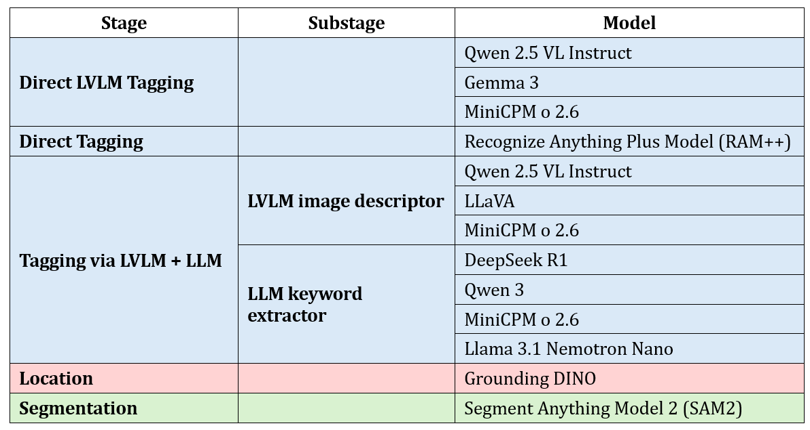

# TALOS: A Modular and Automatic System for Open-Vocabulary Semantic Instance Segmentation


Most existing semantic instance segmentation systems—like Detectron2, YOLO, and similar—work with a **closed set of object categories**, typically those found in datasets such as MS-COCO or Pascal VOC. While their accuracy is high within those limits, they struggle in real-world environments where the variety of objects goes far beyond the training data. This is especially problematic in fields like mobile robotics, where systems often encounter unfamiliar objects.

**TALOS** (TAgging–LOcation–Segmentation) is an open-vocabulary instance segmentation pipeline designed to overcome these limitations. It works in three main stages: *Tagging* extracts object labels from the image, *Location* locates those objects, and *Segmentation* generates binary masks for each detected instance. Each stage is modular and independent, making it easy to extend or replace components with newer models as needed.

Compared to traditional closed-vocabulary detectors, TALOS brings several key advantages. It correctly segments individual object instances, works automatically from just an RGB image, supports easy model integration thanks to its modular architecture, and allows for natural-language customization using large language models.

<div align="center">


*Detectron2 (left, pink) is limited to COCO categories and often mislabels or misses unknown objects. TALOS (right, green) correctly identifies and segments previously unseen categories like "curtain", "piano" or "avocado".*

</div>

TALOS has been integrated as a ROS 2 node and connected to **Voxeland**, a 3D semantic mapping platform that previously relied on closed-vocabulary systems. Results on a variety of input images show improved semantic detail, which translates into richer and more informative maps—an essential step toward more capable and aware robotic systems.

[📄 Read the TALOS paper (Spanish PDF)](./docs/paper/talos_paper.pdf)

*This project is currently under development. Please check the **develop** branch for the latest updates.*

---

## Pipeline overview

TALOS takes an arbitrary number of **RGB images** as input and produces **instance-level segmentations** for each image, that include binary masks for each object instance, along with their corresponding bounding boxes and semantic labels.

<div align="center">


*The TALOS pipeline consists of three main stages: Tagging, Location, and Segmentation. Each stage is modular and can be extended or replaced with new models as needed.*

</div>

The pipeline is designed to be **modular**, allowing for easy integration of new models and components. The three main stages of the pipeline are as follows:

### 1. Tagging
- **Description**: Extracts object category labels using large-scale models (LVLMs and/or LLMs).
- **Input**: RGB image.
- **Output**: List of semantic object categories (textual labels)
- **Tagging methods**:
  - **Direct Tagging**: Uses a Large Vision-Language Model (LVLM) to extract labels directly. A smaller and more specific model like RAM++ is suitable for this Tagging method too, but this is not as flexible as the LVLM approach.
  - **Tagging via LVLM Image Description and LLM Keyword Extraction**: Uses a LVLM to generate a description of the image, which is then processed by an LLM to extract keywords of the object categories that are present in the image description.

### 2. Location
- **Description**: Locates objects described by the category tags using a visual grounding model.
- **Inputs**:
  - RGB image
  - List of object labels (output from the Tagging stage).
- **Output**: List of bounding boxes with label and confidence.

### 3. Segmentation
- **Description**: Produces accurate instance segmentation masks using category-agnostic segmentation models.
- **Inputs**:
  - RGB image.
  - Located bounding boxes for each detected object (output from the Location stage).
- **Outputs**:
  - Binary masks, one per object instance.
  - Detections JSON that includes the semantic label, bounding box coordinates, location confidence score for each instance and mask ID.

---

## 🧠 Integrated technologies and models

TALOS integrates a variety of advanced models and technologies to achieve its open-vocabulary instance segmentation capabilities:

<div align="center">



</div>


---

## ⚙️ Installation and Usage

### Installation

- Recomended Python version: **Python 3.10.12** or higher.
- Recomended operating system: **Ubuntu 22.04** or higher.

To install TALOS, follow these steps:

1. **Clone the repository and its submodules**

   ```bash
   git clone --recurse-submodules https://github.com/macorisd/TALOS.git
   ```

   If you plan to use TALOS for robotics tasks with ROS 2, clone it into the `src/` directory of your ROS 2 workspace.

2. **Create virtual environment and install dependencies**
   You can manage dependencies however you like, but a helper script is provided to automate virtual-environment creation and dependency installation:

   ```bash
   chmod +x venvs/update_venv.bash
   ./venvs/update_venv.bash
   ```

   This will create (or update) a Python 3 virtual environment named `talos_env` in `venvs/` and install all required packages.

   Alternatively, install manually:

   ```bash
   python3 -m venv venvs/talos_env
   source venvs/talos_env/bin/activate
   pip install -r requirements.txt
   ```

3. **Install models and technologies**

* **Supported Ollama models:** To use the LLaVA, DeepSeek, and MiniCPM models in the TALOS Tagging stage, install Ollama and pull the models:

  ```bash
  curl -fsSL https://ollama.com/install.sh | sh
  ollama pull llava:34b
  ollama pull deepseek-r1:14b
  ollama pull minicpm-v:8b
  ```

* **Recognize Anything Plus Model (RAM++):** To use RAM++ in the TALOS Tagging stage, download the `.pth` file (The recommended checkpoint file is `ram_plus_swin_large_14m.pth`) into `src/pipeline/talos/tagging/direct_tagging/ram_plus/models/`. This file available at:
  [https://huggingface.co/xinyu1205/recognize-anything-plus-model/blob/main/ram\_plus\_swin\_large\_14m.pth](https://huggingface.co/xinyu1205/recognize-anything-plus-model/blob/main/ram_plus_swin_large_14m.pth)

* **Gemma 3 (Hugging Face):** To use Gemma in the TALOS Tagging stage, set your Hugging Face token as an environment variable. For example, add the following to `pipeline/.env`:

  ```bash
  HUGGINGFACE_TOKEN=<your_token_here>
  ```

* **Other supported Hugging Face models:** Other Hugging Face models used by TALOS do not require additional installation steps. They are automatically downloaded when the pipeline is run with each model for the first time.


### Usage

These usage instructions demonstrate running TALOS in “user” mode. To launch the ROS 2 node for robotic applications (e.g., building 3D semantic maps), please refer to the README.md in src/talos_ros2.

1. **Add input images**

Place your input images (recommended formats: png, jpg, jpeg) into src/pipeline/input_images/ before running TALOS.

2. **Activate the virtual environment**  

   Before running the pipeline, ensure your Python virtual environment is active:
   ```bash
   source venvs/talos_env/bin/activate
    ```

3. **Run the pipeline**

   Navigate to the pipeline directory and launch the main script:

   ```bash
   cd src/pipeline
   python pipeline_main.py [OPTIONS]
   ```

   The **outputs** for each stage will be saved in the `src/pipeline/output/` directory.

   Available command-line arguments:

   * `-img`, `--input_images`

     * Zero or more image filenames (e.g., `image1.png image2.jpg`).
     * Defaults to `['desk.jpg']` (provided example image) if not specified.
     * Images must be located in the `src/pipeline/input_images/` folder.

   * `-iters`, `--iterations`

     * Integer number of times to run the pipeline per image.
     * Defaults to `1`.

   * `-cfg`, `--config_file`

     * Configuration filename (e.g., `config.json`, `config2.json`).
     * Defaults to `config.json`.
     * File must be located in the `src/pipeline/config/` directory.

    An execution example:
  
    ```bash
    cd src/pipeline
    python pipeline_main.py -img input_image1.jpg input_image2.jpg -iters 2 -cfg config2.json
    ```

    Running without any options will process the example image `desk.jpg` once using `config.json`.

    You can also consult the help message for more information:

    ```bash
    cd src/pipeline
    python pipeline_main.py --help
    ```

### Configuration and customization

* **Configuration file**: The pipeline configuration is defined in a JSON file located in `src/pipeline/config/`. The default configuration file is `config.json`, but you can create and use your own configuration files. This file specifies the models and parameters for each stage of the pipeline.

* **Large Vision-Language Models (LVLMs) and Large Language Models (LLMs) prompt customization**: TALOS allows you to customize the prompts used by the LVLMs and LLMs in the Tagging stage. You can modify the prompt `txt` files, located in:
  - **Direct LVLM Tagging**: `src/pipeline/talos/tagging/direct_lvlm_tagging/prompts/prompt.txt`
  - **Tagging with LVLM Image Description and LLM Keyword Extraction**:
    - LVLM Image Description: `src/pipeline/talos/tagging/lvlm_llm_tagging/lvlm_image_description/base_image_description.py` (this prompt is defined in the code because it is much shorter than the other prompts)
    - LLM Keyword Extraction: `src/pipeline/talos/tagging/lvlm_llm_tagging/llm_keyword_extraction/prompts/prompt1.txt` (main prompt) and `.../prompt2.txt` (output enhancement prompt)

---

## 📊 TALOS pipeline evaluation and results

Please check the [evaluation README](./src/evaluation/README.md) for detailed information about the evaluation metrics and results of the TALOS pipeline.

Please note that only the Tagging models are shown in the evaluation results, as the Location stage for every case was performed using Grounding DINO, and the Segmentation stage was performed using SAM2 (Segment Anything Model 2). The evaluation results are based on a random subset of 1,000 images from the LVIS dataset.

| TAGGING MODEL(S)             | Detection count | Label precision | Label recall | BBox sim. | Mask sim. | Avg final score | Avg exec. time (s) |
|------------------------------|----------------|----------------|--------------|-----------|-----------|-----------------|--------------------|
| MiniCPM                      | 68.88          | 40.88          | 41.92        | 75.26     | 71.09     | 59.61           | 1.63               |
| Gemma                        | 58.80          | 30.79          | 58.73        | 75.43     | 71.99     | 59.15           | 8.11               |
| Qwen                         | 58.01          | 29.78          | 59.73        | 74.90     | 72.02     | 58.89           | 4.18               |
| MiniCPM + MiniCPM            | 65.34          | 27.65          | 47.08        | 74.68     | 72.28     | 57.41           | 2.68               |
| LLaVA + MiniCPM              | 64.92          | 28.60          | 43.58        | 74.78     | 70.88     | 56.55           | 5.63               |
| RAM Plus                     | 66.22          | 26.32          | 49.50        | 71.15     | 68.86     | 56.41           | 0.63               |


---

## 🤝 How to contribute

Contributions are welcome!

- Fork the repository.
- Create a new branch: git checkout -b feature/my-feature.
- Make your changes.
- Push to your fork: git push origin feature/my-feature.
- Submit a pull request with a clear description of your changes.

All pull requests will be reviewed and require approval before being merged into the main branch.


--- 

## 📚 Citation

If you use TALOS in your research, please cite the TALOS paper as follows:

```bibtex
@article{decena2025talos,
  author  = {Decena-Gimenez, M. and Moncada-Ramirez, J. and Ruiz-Sarmiento, J.R. and Gonzalez-Jimenez, J.},
  title   = {Instance semantic segmentation using an open vocabulary},
  journal = {Simposio CEA de Robótica, Bioingeniería, Visión Artificial y Automática Marina 2025},
  volume  = {1},
  number  = {1},
  year    = {2025},
  url     = {https://ingmec.ual.es/ojs/index.php/RBVM25/article/view/38}
}
```

---

## 📄 License

This project is licensed under the GPL-3.0 License. See the [LICENSE](./LICENSE) file for details.


---

## ✍️ Author's note

Hi! I'm Maco 👋​

This project is being developed as part of my Bachelor's Thesis in Software Engineering, as a member of the MAPIR research group at the University of Málaga, Spain. It would not have been possible without the trust and support of my professors Javier and Raúl. Thank you for believing in me!


---

## 📬 Contact

If you have any questions, suggestions, or feedback, please reach out to me!

- Linkedin: [macorisd](https://www.linkedin.com/in/macorisd/)
- Email: [macorisd@gmail.com](mailto:macorisd@gmail.com)
